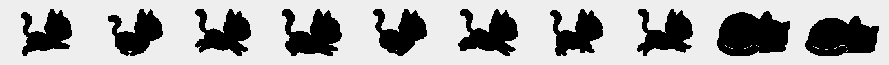

# TokenCat 🐈‍🔥

[](https://www.apple.com/macos/)
[](https://swift.org)
[](./LICENSE)

A tiny macOS menu-bar app — like [RunCat](https://github.com/Kyome22/RunCat_for_macOS), but the cat runs faster the more **tokens** you're burning across your coding agents, read live from [`ccusage`](https://github.com/ryoppippi/ccusage).

<p align="center">
  
</p>

The cat's pace tracks your real-time token burn rate: idle when you're not coding, a brisk trot at a few thousand tokens/min, a full sprint when an agent is really cooking. Click it for cost/hr, this block's cost, the projection, and today's per-agent (Claude + Codex) breakdown.

See [`SPEC.md`](./SPEC.md) for the full design.

## Requirements

- macOS 13+
- Swift toolchain (Xcode Command Line Tools: `xcode-select --install`)
- `ccusage` on your `PATH`, **or** `bun` installed (the app falls back to `bunx ccusage`)

## Run

```sh
swift run            # from the repo root
```

You should see a cat appear in your menu bar with the current burn rate (e.g. `🐈 4.3k/m`). Click it for cost/hr, this block's cost, the projection, and today's per-agent (Claude + Codex) breakdown. The cat sleeps when there's no active session.

## Package as an app

```sh
./package.sh                       # → build/TokenCat.app (self-contained)
open build/TokenCat.app            # run it
cp -R build/TokenCat.app /Applications/   # install
```

`package.sh` builds the release binary, bundles the sprites into `Contents/Resources/assets/`, builds the icon from `assets/appicon_1024.png` into `AppIcon.icns`, writes an `Info.plist` (`LSUIElement` → menu-bar only, no Dock icon), and ad-hoc code-signs. The app is unsigned for distribution — to share it you'd need a Developer ID + notarization.

## Build just the binary

```sh
swift build -c release
./.build/release/tokencat
```

The sprite assets live in `assets/`. A bundled `.app` loads them from its own `Resources`; the bare binary finds them relative to the repo root. If you move the binary elsewhere, point it at the assets folder:

```sh
TOKENCAT_ASSETS=/path/to/assets ./tokencat
```

## Debugging

```sh
TOKENCAT_DEBUG=1 swift run    # prints each usage snapshot + poll results to stderr
```

## How it works

- **Cat speed:** `ccusage blocks --active --json` → `burnRate.tokensPerMinuteForIndicator`, mapped on a log scale to 3–18 fps (`Sources/tokencat/CatAnimator.swift`).
- **Breakdown:** `ccusage claude daily --json` and `ccusage codex daily --json`, today's row.
- **Sprites:** monochrome silhouette PNG template frames in `assets/run/` and `assets/sleep/`.

Tuning constants (sprint cap, idle threshold, coast, fps range) are at the top of `CatAnimator.swift`.

## License

[MIT](./LICENSE) © [nonkung51](https://github.com/nonkung51)
